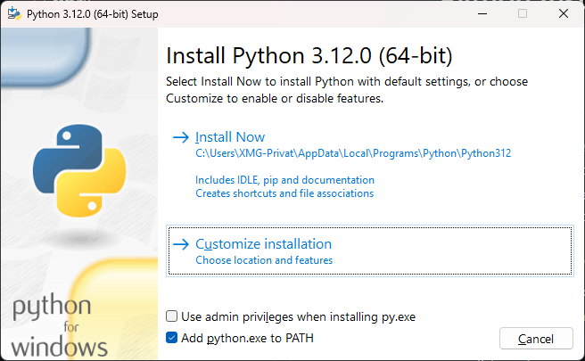
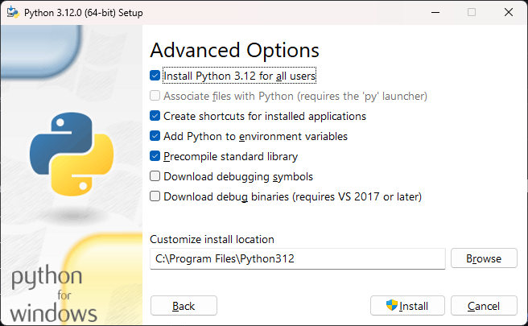
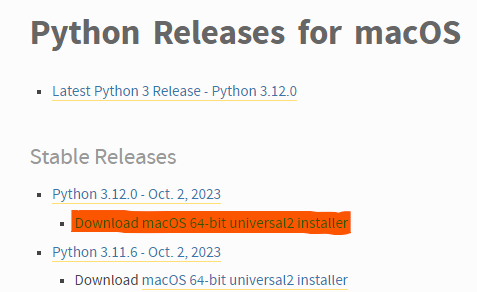

# Installation

## Python

### Windows

1. Open https://www.python.org/downloads/windows/ 
2. Download the installer for a stable python release (we recommend version 3.12.0)


3. Execute (with a double click) the installer (e.g. python-3.12.0-amd64.exe) that you just downloaded
4. Make sure that all checkboxes are selected



5. Click on "Customize installation" and select the first 4 checkboxes
6. Click on "Next" and select the checkbox "Install Python for all users"




8. Click "Install". After installation, you should see a "Setup successful" message.


10. Verify the Python-Installation via the Terminal:

   ```bash
   python --version
   // expected result:
   Python 3.12.0
   ```

### MacOS

1. Open https://www.python.org/downloads/macos/ 
2. Download the installer for a stable python release (we recommend version 3.12.0)




3. Execute (with a double click) the installer (e.g. python-3.12.0-macos11.pkg) that you just downloaded
4. Follow the instructions given by the installer


5. After installation, you should see a "Setup successful" message.
6. A window with the title "Python 3.12" will open. Double click the files "Install Certificates" and "Update Shell Profile"
7. Verify the Python-Installation via the Terminal:

   ```bash
   python3 --version
   // expected result:
   Python 3.12.0
   ```

<br>
<br>

> As an additional step you can update your path within the terminal: 
````bash
sudo ln -s /usr/local/bin/python3 /usr/local/bin/python
````

You should now be able to run the version command as seen below:
   ```bash
   python --version
   // expected result:
   Python 3.12.0
   ```


### __Linux__
If you are using the LTS version of ubuntu, execute the following commands:

```bash
$ sudo apt-get install software-properties-common
$ sudo add-apt-repository ppa:deadsnakes/ppa
$ sudo apt-get update
$ sudo apt-get install python3.11.3
``` 

Verify that you have a current Python Version by running:
```bash
python --version
// expected result:
Python 3.12.0
```

## IDE

Download and install a IDE of your choice. We recommend using PyCharm Community Edition.

To download PyCharm follow the steps:

1. Open [https://www.jetbrains.com/pycharm/download/](https://www.jetbrains.com/pycharm/download/) and scroll down to the Comunnity Download


2. Select and download a suitable version for your operating system
3. Install PyCharm Community Edition

