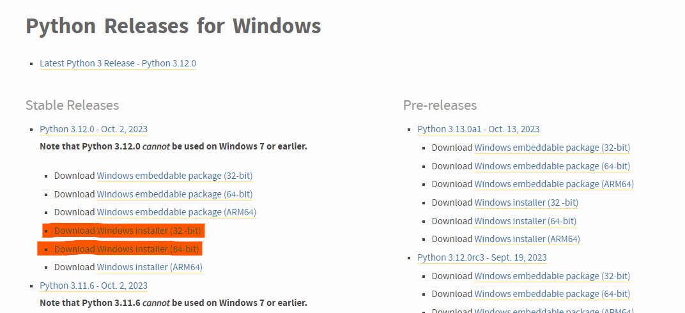
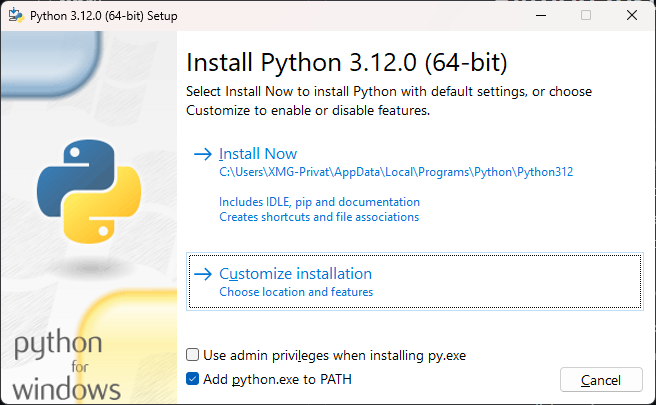
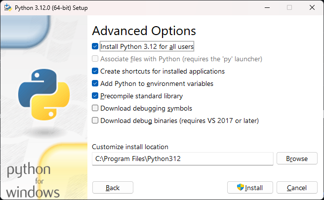
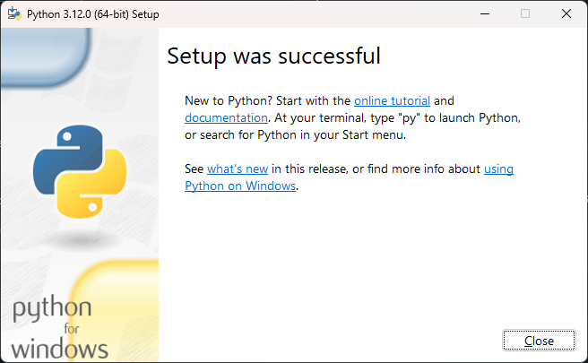
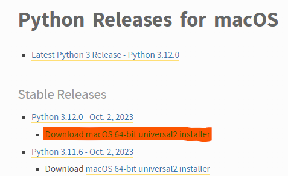
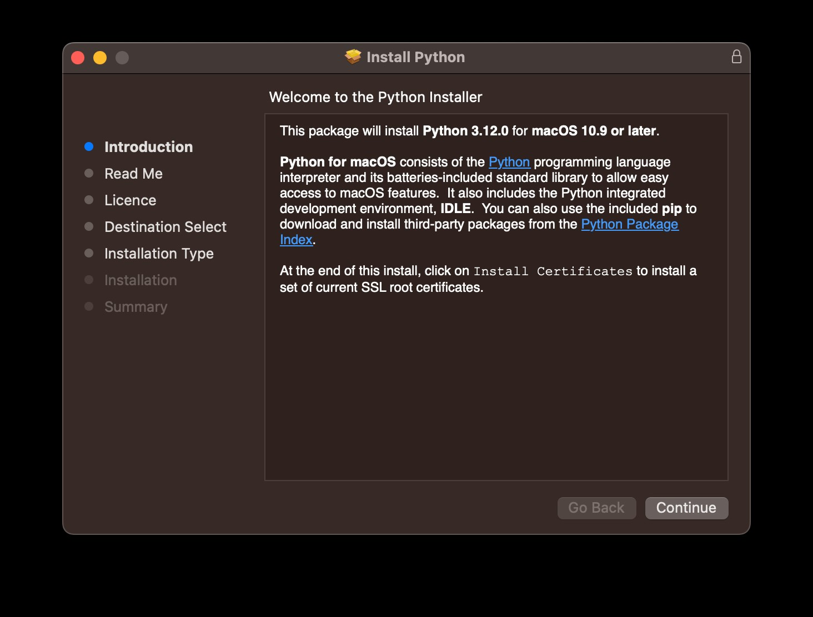
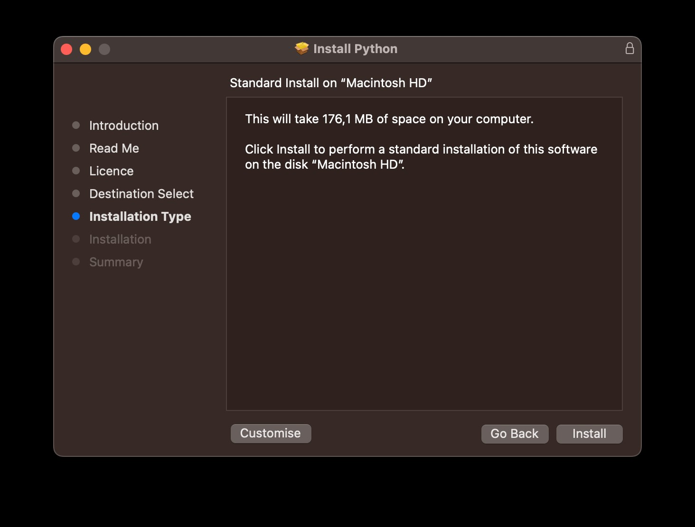

# Installation

## Python

### Windows

1. Rufe den folgenden Link auf: https://www.python.org/downloads/windows/ 
2. Laden dir den Installer für eine stabile Python-Version herunter (wir empfehlen Version 3.12.0).




3. Führe (mit einem Doppelklick) den zuvor heruntergeladenen Installer (z. B. python-3.12.0-amd64.exe) aus
4. Wähle alle Optionen aus



5. Klicke auf "Customize installation" und wähle die ersten 4 Optionen aus
6. Klicke auf "Next" und wähle die Option "Install Python for all users" aus




8. Klicke auf "Install". Nach der Installation sollte die Meldung "Installation erfolgreich" angezeigt werden.




10. Überprüfe mit dem Terminal (z.B. CMD, PowerShell, GitBash) ob Python richtig installiert wurde:

   ```bash
   python --version
   // ausgabe:
   Python 3.12.0
   ```

### MacOS

1. Rufe den folgenden Link auf: https://www.python.org/downloads/macos/ 
2. Laden dir den Installer für eine stabile Python-Version herunter (wir empfehlen Version 3.12.0).




3. Führe (mit einem Doppelklick) den zuvor heruntergeladenen Installer (z.B. python-3.12.0-macos11.pkg) aus
4. Folge den Anweisungen des Installers




5. Nach der Installation sollte die Meldung "Installation erfolgreich" angezeigt werden.
6. Nach der Installation öffnet sich ein Fenster mit dem Namen "Python 3.12". Führe die Dateien (mit einem Doppelklick) "Install Certificates" und "Update Shell Profile" aus
7. Überprüfe mit dem Terminal ob Python richtig installiert wurde:

   ```bash
   python3 --version
   // ausgabe
   Python 3.12.0
   ```

<br>
<br>

> Als einen zusätzlichen Schritt kannst du noch deinen Python Pfad im Terminal aktualisieren: 
````bash
sudo ln -s /usr/local/bin/python3 /usr/local/bin/python
````

Du solltest nun in der Lage sein die Python version mit dem folgendem Befehl dir ausgeben zu lassen:
   ```bash
   python --version
   // ausgabe:
   Python 3.12.0
   ```


### __Linux__
Wenn du eine LTS Version von Ubuntu benutzt, führe die folgenden Befehle aus:

```bash
$ sudo apt-get install software-properties-common
$ sudo add-apt-repository ppa:deadsnakes/ppa
$ sudo apt-get update
$ sudo apt-get install python3.11.3
``` 

Überprüfe mit dem Terminal, ob Python richtig installiert wurde:
```bash
python --version
// ausgabe:
Python 3.12.0
```

## IDE

Installiere dir eine IDE deiner Wahl. Wir empfehlen PyCharm Community Edition.

### Installation

1. Rufe den folgenden Link auf [https://www.jetbrains.com/pycharm/download/](https://www.jetbrains.com/pycharm/download/) und scrolle bis zum Download der Community Version


2. Lade dir eine passende Version für dein Betriebssystem herunter
3. Installiere (mit einem Doppelklick) PyCharm Community Edition

